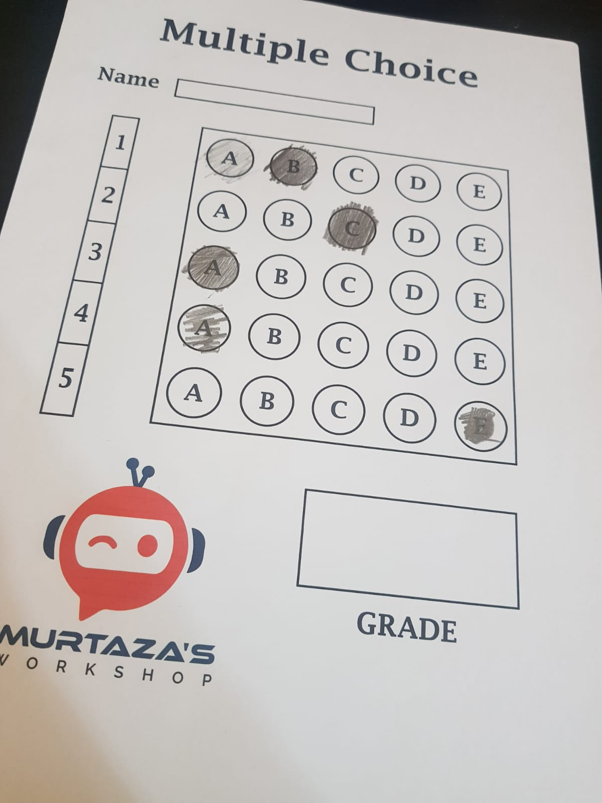

# OMR Detection using OpenCV

Detect and analyze Optical Marks on scanned forms using the OpenCV library. Optical Mark Recognition (OMR) is a technology that detects and processes marked areas on printed documents, commonly used in surveys, tests, and questionnaires.

## Features

- **Accurate Detection**: Utilizes OpenCV's image processing capabilities to accurately identify filled circles or checkboxes on scanned OMR sheets.

- **Real-time Usage**: Can be used for real-time OMR detection, enabling instant feedback on user-submitted forms.

- **Flexibility**: Works with both grayscale and color images, accommodating a variety of input sources.

- **Easy Integration**: The codebase is designed to be easy to understand, making it accessible for developers to integrate OMR detection into their projects.

## Description

This repository hosts a Python-based implementation of OMR detection using the OpenCV library. OMR is a widely-used technology in educational and survey domains for extracting meaningful data from scanned forms. This project aims to provide a reliable and customizable solution for integrating OMR capabilities into applications.

## Real-time Usage

In addition to batch processing, the `OMR_Main.py` script supports real-time OMR detection. This means you can use it to instantly analyze user-submitted forms and provide immediate feedback on the marks obtained.

## Usage

The `OMR_Main.py` script in this repository can be used to apply the OMR detection algorithm to your images. By running the script, you can automatically detect and analyze marked areas on OMR sheets.

## Customization

The parameters of the OMR detection algorithm can be customized according to the specific requirements of your OMR forms. This allows you to adapt the algorithm to different mark sizes, colors, and form layouts.

## Contributing

Contributions to this project are welcome! If you find any issues or have ideas for improvements, feel free to open an issue or submit a pull request.
